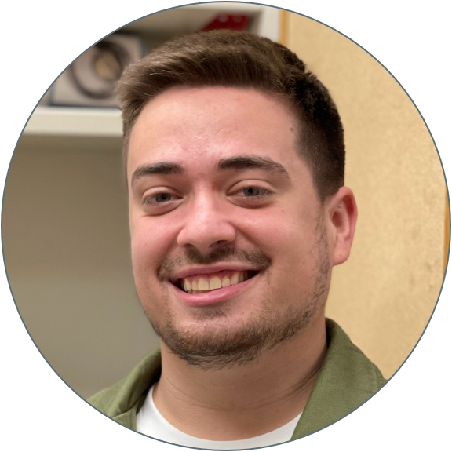
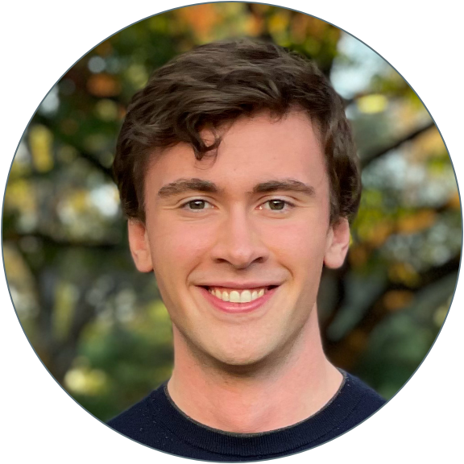
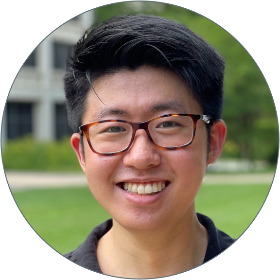

<figure class="figtwocolleft">
  
  

   
  <b>Jeff Farrell</b>  
  Lab Head, Stadtman Investigator  
  Founded the lab in 2020  
  jeffrey <i>[dot]</i> farrell <i>[at]</i> nih.gov  
  

</figure>

<figure class="figtwocolright">
  
  

   
  <b>Morgan Prochaska</b>  
  Aquatic Specialist & Lab Manager  
  Joined the lab in 2023  
  morgan <i>[dot]</i> prochaska <i>[at]</i> nih.gov  
  

</figure>

<figure class="figtwocolleft">
  
  

   
  <b>Jackson Crane</b>  
  Post-baccalaureate Fellow  
  Joined the lab in 2024  
  jackson <i>[dot]</i> crane <i>[at]</i> nih.gov  
  

</figure>

<figure class="figtwocolright">
  
  

   
  <b>Victor Naturale</b>  
  Jane Coffin Childs Fellow  
  Joined the lab in 2025  
  victor <i>[dot]</i> naturale <i>[at]</i> nih.gov  
  

</figure>

<figure class="figtwocolleft">
  
  

   
  <b>Michael Nunneley</b>  
  Post-doctoral Fellow  
  Joined the lab in 2023  
  michael <i>[dot]</i> nunneley <i>[at]</i> nih.gov  
  

</figure>

<figure class="figtwocolright">
  
  

   
  <b>Gilseung Park</b>  
  Post-doctoral Fellow  
  Joined the lab in 2023  
  gilseung <i>[dot]</i> park <i>[at]</i> nih.gov  
  

</figure>

<figure class="figtwocolleft">
  
  

   
  <b>Ella Segal</b>  
  Post-baccalaureate Fellow  
  Joined the lab in 2024  
  ella <i>[dot]</i> segal <i>[at]</i> nih.gov  
  

</figure>

<figure class="figtwocolright">
  
  

   
  <b>Abhinav Sur</b>  
  K99 Pathway to Independence Fellow  
  Joined the lab in 2020  
  abhinav <i>[dot]</i> sur <i>[at]</i> nih.gov  
  

</figure>

<figure class="figtwocolleft">
  
  

   
  <b>Yalan Wu</b>  
  MD/PhD Student  
  Joined the lab in 2025  
  yalan <i>[dot]</i> wu <i>[at]</i> nih.gov  
  

</figure>

<h1 class="c-article__title">Lab Alumni</h1>

<figure class="figonecol">
  
  <b>Cheng-Yi Chen</b>  
  Post-doctoral Fellow  
  2021–2022  
  Next step: Scientist at Vizgen  
</figure> 

<figure class="figonecol">
  
  <b>Jeremy Popowitz</b>  
  Post-baccalaureate Fellow  
  2020–2022  
  Next step: MD Student at A.T. Still University 
</figure> 

<figure class="figonecol">
  
  <b>Eric Upton</b>  
  Post-baccalaureate Fellow  
  2020–2022  
  Next step: PhD Student at Washington University in St. Louis  
</figure> 

<figure class="figonecol">
  
  <b>Paulina Capar</b>  
  Aquatic Research Specialist  
  2020–2023  
  Next step: Project Manager at NIH Shared Zebrafish Facility
</figure>

<figure class="figonecol">
  
  <b>Sean Lee</b>  
  Post-baccalaureate Fellow  
  2022-2024  
  Next step: PhD Student at University of Colorado, Anschutz
</figure>

<figure class="figonecol">
  
  <b>Avani Modak</b>  
  Post-baccalaureate Fellow  
  2022-2024  
  Next step: PhD Student at University of Pennsylvania
</figure>