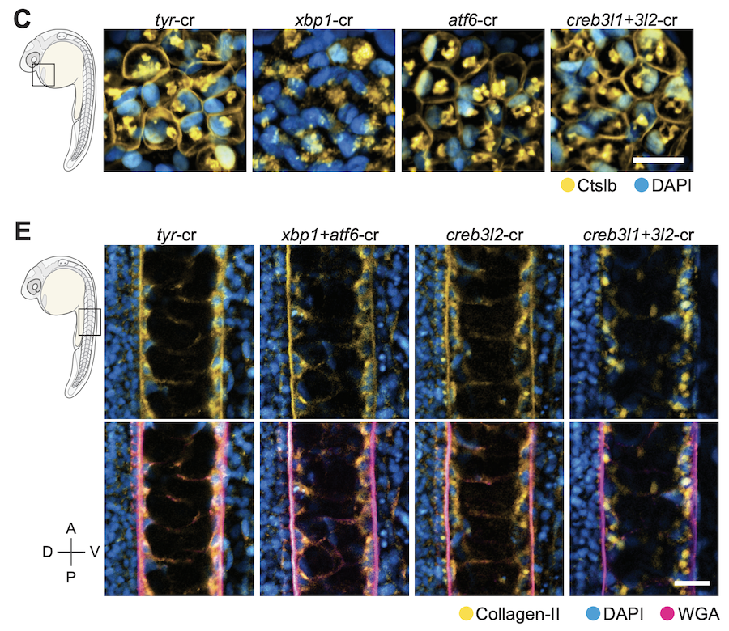

## Preprint: Gene module reconstruction elucidates cellular differentiation processes and the regulatory logic of specialized secretion
### December 29, 2023

New preprint!

We integrated gene expression dynamics from single-cell RNAseq developmental trajectories with functional annotations to generate gene modules that describe differentiation. When applied to the zebrafish axial mesoderm, these revealed known and newly associated differentiation processes (as well as their temporal ordering), including the anticipatory deployment of the unfolded protein response (UPR) in notochord and hatching gland differentiation. By profiling loss- and gain-of-function embryos, we found that the UPR transcription factors <i>creb3l1</i>, <i>creb3l2</i>, and <i>xbp1</i> are master regulators of a general secretion program. <i>creb3l1/creb3l2</i> additionally activate an extracellular matrix secretion program, while Xbp1 partners with Bhlha15 to activate a gland-specific secretion program. This reveals how the regulatory logic by which these related cell types activate shared and cell-type-specific secretory programs.

Read it at <a href="https://www.biorxiv.org/content/10.1101/2023.12.29.573643"><i>bioRxiv</i></a>!

<figure></figure>

-----------------------------------------

## Publication: Single-cell analysis of shared signatures and transcriptional diversity during zebrafish development
### November 22, 2023

Our preprint from March is now published in its final form at <i>Developmental Cell</i>! A constructive review process resulted in new presentation of the long-term states analysis, new imaging of intestinal smooth muscle, and new transcriptional analyses of best4+ cells.

Read the final version at <a href="https://www.sciencedirect.com/science/article/pii/S1534580723005774"><i>Developmental Cell</i></a>!

<figure></figure>

-----------------------------------------

## New Lab Photo
### November 22, 2023

We finally got the entire Farrell Lab together at one time for an updated lab photo.

<figure align="center">

</figure>

-----------------------------------------

## Abhinav's Paper Accepted!!
### October 2, 2023

Abhinav's paper was accepted to Developmental Cell today! We went out as a group to celebrate him and the lab's first paper!

<figure align="center">

</figure>

-----------------------------------------

## Preprint: Germ cells do not progress through spermatogenesis in the infertile zebrafish testis
### September 5, 2023

In a fun collaboration with Jamie Gagnon's lab, we helped analyze single-cell RNAseq data generated from zebrafish testes at several different points in their life, as their fertility declines. While testes from older males had spermatogonia, they had fewer spermatocytes and few or no round and elongating spermatids, suggesting a block in differentiation. Instead, a high proportion of immune cells were found in aged testes, as well as an aberrant gene expression program.

Read it at <a href="https://www.biorxiv.org/content/10.1101/2023.09.05.556432v2"><i>bioRxiv</i></a>!

<figure></figure>

-----------------------------------------

## NIH Relay Race
### September 14, 2023

The Farrell and Rogers labs ran the NIH Relay Race (as the 'FeralKats'). Pictured here are our runners: Michael, Morgan, Selvaraj, Will, and Abhinav.

<figure align="center">

</figure>

-----------------------------------------

## Michael joins the lab!
### July 3, 2023

Michael Nunneley has joined the lab as a new post-doc! He received his PhD from the University of Georgia, where he worked in the labs of Nancy Manley and Jonathan Eggenschwiler. For his thesis, he studied mechanisms of thymus and parathyroid cell fate specification during mouse development.

Welcome, Michael!

<figure align="center">
  
</figure> 

-----------------------------------------

## Administrative Professionals Day
### June 23, 2023

We celebrated (a bit belatedly) Administrative Professionals Day. There's no way the lab could keep running without the help of Nancy and Tina, the incredibly talented and incredibly crucial administrative support for our lab.

<figure align="center">

</figure>

-----------------------------------------

## Morgan joins the lab!
### May 22, 2023

Morgan Prochaska has joined the lab as a new lab manager and aquatic specialist! She received her PhD from Clarkson University, where she worked in the lab of Kenneth Wallace. For her thesis, she studied zebrafish intestinal development.

Welcome, Morgan!

<figure align="center">
  
</figure> 

-----------------------------------------

## Summer Picnic
### May 5, 2023

We took a cross-lab boat ride down the Potomac to enjoy the summer views, followed by a cross-lab picnic. Pictured here are members of the Farrell, Rocha, Rogers, and Sheppard labs.

<figure align="center">

</figure>

-----------------------------------------

## Mid-Atlantic SDB Meeting
### April 22, 2023

The Farrell Lab attended the Mid-Atlantic Society for Developmental Biology meeting at Princeton. We managed to get a group portrait together, as well as a portrait of the entire visiting crew from NICHD, including the Farrell, Rocha, Rogers, and Weinstein labs.

<figure align="center">

</figure>

<figure align="center">

</figure>

-----------------------------------------

## Preprint: Single-cell temporal dynamics reveals the relative contributions of transcription and degradation to cell-type specific gene expression in zebrafish embryos
### April 21, 2023

Very excited about this manuscript, from a long-term collaboration with the lab of Michal Rabani. Establishing cell-type-specific gene expression programs is a major part of the process of development. While we know that cell-type-specific transcription plays a major role, we wanted to understand whether cell-type-specific differences in degradation of maternally loaded mRNAs (which are initially ubiquitous) additionally played a role. We developed an approach to label and distinguish maternal and zygotic mRNAs in Drop-seq single-cell RNAseq and built kinetic models to follow the rate of degradation of maternal mRNAs in different cell types. Primordial germ cells have long been known to selectively stabilize some maternal mRNAs, but we find evidence that the enveloping layer (another cell type that becomes distinct very early in development) may also employ this mechanism, in addition to cell-type-specific transcription.

Read it at <a href="https://www.biorxiv.org/content/10.1101/2023.04.20.537620v1"><i>bioRxiv</i></a>!

<figure align="center">

</figure>

-----------------------------------------

## Preprint: Single-cell analysis of shared signatures and transcriptional diversity during zebrafish development
### March 21, 2023

SO proud to see this work out. This has been one of the major ongoing efforts in the lab for its first three years.

We generated a 489,000 cell atlas of 62 stages of zebrafish development that extends until the fish are freely swimming and hunting. Globally, we identified the long-term transcriptional states during development and the gene expression programs that are reused across cell types. Additionally, focused analyses within particular tissues revealed several surprising cell states, including distinct cell populations within intestinal smooth muscle, distinct pericyte subtypes, and zebrafish homologs of <i>best4+</i> intestinal cells. We confirmed all populations using <i>in situ</i> hybridization, built transcriptional trajectories to describe their likely developmental process, and predicted candidate regulators of each cell type. To make this work accessible, we generated the online resource, <a href="https://daniocell.nichd.nih.gov/">Daniocell</a> for browsing zebrafish single-cell RNAseq data.

Read it at <a href="https://www.biorxiv.org/content/10.1101/2023.03.20.533545v3"><i>bioRxiv</i></a>!

<figure align="center">

</figure>

-----------------------------------------

## Preprint: Differentiation trajectories of the Hydra nervous system reveal transcriptional regulators of neuronal cell fate
### March 16, 2023

Our long-term collaboration with the lab of Celina Juliano continues! We have previously profiled cells during Hydra homeostatic development using single-cell RNAse, but here we dive in specifically to the nervous system. Abby generated new single-cell RNAseq libraries after enriching for neurons, which allowed us to more comprehensively reconstruct the developmental trajectories that give rise to these distinct neural types. Moreover, it allowed us to explore the multiple trajectories that can give rise to many of these cell types: direct specification from interstitial stem cells, compared to transdifferentiation from other neuronal cell types as cells move along the Hydra body column.

Read it at <a href="https://www.biorxiv.org/content/10.1101/2023.03.15.531610v2"><i>bioRxiv</i></a>!

<figure align="center">

</figure>

-----------------------------------------

## Ice Skating
### February 24, 2023

The Farrell and Rogers labs had an enjoyable joint outing to go ice skating together and enjoy the winter weather.

<figure align="center">

</figure>

