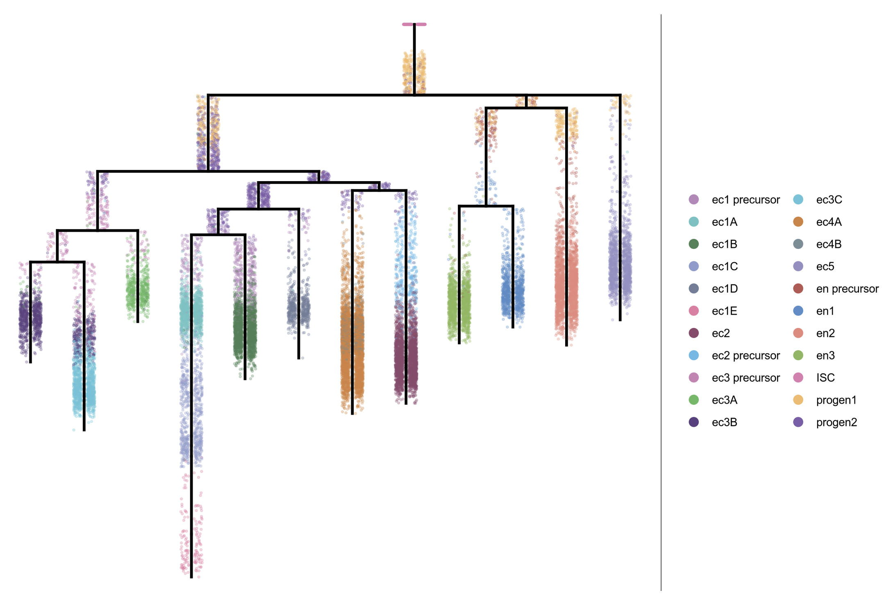
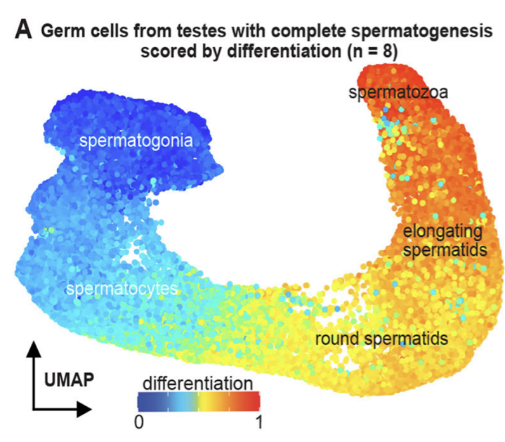

A full list of publications is available at [Pubmed](https://www.ncbi.nlm.nih.gov/myncbi/jeffrey%20a..farrell.1/bibliography/public/).

<b>prdm1a drives a fate switch between hair cells of different mechanosensory organs.</b> 
Sandler JE, Tsai YY, Chen S, Sabin L, Lush ME, Sur A, Ellis E, Tran NTT, Cook M, Scott AR, Kniss JS, Farrell JA, Piotrowski T. 

<i>Nature Communications</i>. 2025 Aug 18; 16(1):7662. doi: 10.1038/s41467-025-62942-0. 
<i>bioRxiv</i>. 2025 Jun 03; doi: 10.1101/2025.06.01.657251. 

[<a href="https://pubmed.ncbi.nlm.nih.gov/40825768/">Pubmed</a>]
[<a href="https://www.nature.com/articles/s41467-025-62942-0">Nature Communications</a>]
[<a href="https://www.biorxiv.org/content/10.1101/2025.06.01.657251v1">bioRxiv</a>]

<b>A Molecular, Spatial, and Regulatory Atlas of the Hydra vulgaris Nervous System.</b> 
Morris Little H, Primack AS, Tsverov J, Mühlbauer S, Cox BD, Busse C, Schneid S, Louwagie A, Cazet JF, David CN, Farrell JA, Juliano CE. 

<i>bioRxiv</i>. 2025 Jun 11; doi: 10.1101/2023.03.15.531610. 

[<a href="https://pubmed.ncbi.nlm.nih.gov/36993575/">Pubmed</a>]
[<a href="https://www.biorxiv.org/content/10.1101/2023.03.15.531610v3">bioRxiv</a>]

<b>Germ cell progression through zebrafish spermatogenesis declines with age.</b> 
Sposato AL, Hollins HL, Llewellyn DR, Weber JM, Schrock MN, <u>Farrell JA</u>, Gagnon JA. 

<i>Development</i>. 2024 Nov 15;151(22). doi:10.1242/dev.204319. 
<i>bioRxiv</i>. 2023 Sep 06; doi:10.1101/2023.09.05.556432 

[<a href="https://pubmed.ncbi.nlm.nih.gov/39470160/">Pubmed</a>]
[<a href="https://journals.biologists.com/dev/article/151/22/dev204319/363018/Germ-cell-progression-through-zebrafish">Development</a>]
[<a href="https://www.biorxiv.org/content/10.1101/2023.09.05.556432v2">bioRxiv</a>]

<b>Gene module reconstruction elucidates cellular differentiation processes and the regulatory logic of specialized secretion</b> 
Wang Y, Liu J, Du LY, Wyss JL, <u>Farrell JA and Schier AF (co-corresponding)</u> . 

<i>Developmental Cell</i>. 2025 Feb 24; 60(4):581-598.e9. doi: 10.1016/j.devcel.2024.10.015 
<i>bioRxiv</i>. 2023 Dec 29; doi:10.1101/2023.12.29.573643 

[<a href="https://pubmed.ncbi.nlm.nih.gov/39591963/">Pubmed</a>]
[<a href="https://www.sciencedirect.com/science/article/pii/S1534580724006348">Developmental Cell</a>]
[<a href="https://www.biorxiv.org/content/10.1101/2023.12.29.573643">bioRxiv</a>]

We integrated gene expression dynamics from single-cell RNAseq developmental trajectories with functional annotations to generate gene modules that describe differentiation. When applied to the zebrafish axial mesoderm, these revealed known and newly associated differentiation processes (as well as their temporal ordering), including the anticipatory deployment of the unfolded protein response (UPR) in notochord and hatching gland differentiation. By profiling loss- and gain-of-function embryos, we found that the UPR transcription factors <i>creb3l1</i>, <i>creb3l2</i>, and <i>xbp1</i> are master regulators of a general secretion program. <i>creb3l1/creb3l2</i> additionally activate an extracellular matrix secretion program, while Xbp1 partners with Bhlha15 to activate a gland-specific secretion program. This reveals how the regulatory logic by which these related cell types activate shared and cell-type-specific secretory programs.

<b>Single-cell temporal dynamics reveals the relative contributions of transcription and degradation to cell-type specific gene expression in zebrafish embryos</b> 
Fishman L, Modak A, Nechooshtan G, Razin T, Erhard F, Regev A, <u>Farrell JA and Rabani M (co-corresponding)</u>. 

<i>Nature Communications</i>. 2024 Apr 10; doi: 10.1038/s41467-024-47290-9 
<i>bioRxiv</i>. 2023 Apr 21; doi:10.1101/2023.04.20.537620 

[<a href="https://pubmed.ncbi.nlm.nih.gov/37131717/">Pubmed</a>]
[<a href="https://www.nature.com/articles/s41467-024-47290-9">Nature Communications</a>]
[<a href="https://www.biorxiv.org/content/10.1101/2023.04.20.537620v1">bioRxiv</a>]

Using combined metabolic labeling and single-cell RNAseq we were able to distinguish between maternally loaded and zygotically transcribed mRNA in zebrafish embryos. This allowed us to quantify the rates of destruction of maternally loaded mRNAs during the maternal-to-zygotic transitions and identify that differential degradation of maternal mRNAs contributes to cell type-specific gene expression programs in cells of the enveloping layer as well as the primordial germ cells. We also identified putative sequence elements in their UTRs that may mediate their different rates of destruction.

<b>Single-cell analysis of shared signatures and transcriptional diversity during zebrafish development</b> 
Sur A, Wang Y, Capar P, Margolin G, Prochaska M, <u>Farrell JA</u>. 

<i>Developmental Cell</i>. 2023 Dec 18; doi:10.1016/j.devcel.2023.11.001 
<i>bioRxiv</i>. 2023 Mar 21; 58 doi:10.1101/2023.03.20.533535 

[<a href="https://pubmed.ncbi.nlm.nih.gov/37995681/">Pubmed</a>] 
[<a href="https://www.sciencedirect.com/science/article/pii/S1534580723005774">Developmental Cell</a>]
[<a href="https://www.biorxiv.org/content/10.1101/2023.03.20.533545v3">bioRxiv</a>]

We generated a 489,000 cell atlas of 62 stages of zebrafish development that extends until the fish are freely swimming and hunting. Globally, we identified the long-term transcriptional states during development and the gene expression programs that are reused across cell types. Additionally, focused analyses within particular tissues revealed several surprising cell states, including distinct cell populations within intestinal smooth muscle, distinct pericyte subtypes, and zebrafish homologs of <i>best4+</i> intestinal cells. We confirmed all populations using <i>in situ</i> hybridization, built transcriptional trajectories to describe their likely developmental process, and predicted candidate regulators of each cell type. To make this work accessible, we generated the online resource, <a href="https://daniocell.nichd.nih.gov/">Daniocell</a> for browsing zebrafish single-cell RNAseq data.

<b>Emergence of neuronal diversity during vertebrate brain development.</b> 
Raj B, <u>Farrell JA</u>, McKenna A, Leslie JL, Schier AF. 

<i>Neuron</i>. 2020; Oct 6;S0896-6273(20)30747-9; doi: 10.1016/j.neuron.2020.09.023. 
<i>biorxiv</i>. 2019; 839860; doi: 10.1101/839860 

[<a href="https://pubmed.ncbi.nlm.nih.gov/33068532/">Pubmed</a>]
[<a href="https://www.sciencedirect.com/science/article/pii/S0896627320307479">Neuron</a>]
[<a href="https://www.biorxiv.org/content/10.1101/839860v1">bioRxiv</a>]

We sequenced and analyzed 200,000 cells from 12 stages of brain development (12 hours to 5 days), generating an atlas of zebrafish brain development. Analysis of the transcriptional trajectories and the gene expression cascades during the development of the retina and the hypothalamus revealed different progenitor strategies between these two tissues, and revealed that fish Muller glia cells seem to become transcriptionally distinct much earlier in development than mammalian ones.

<b>Stem cell differentiation trajectories in Hydra resolved at single-cell resolution.</b> 
Siebert S, <u>Farrell JA</u>, Cazet J, Abeykoon Y, Primack A, Schnitzler C, Juliano CE. 

<i>Science</i>. 2019; 365(6451), eaav9314; doi: 10.1126/science.aav9314 
<i>biorxiv</i>. 2018; 460154; doi: 10.1101/460154 

[<a href="https://pubmed.ncbi.nlm.nih.gov/31346039/">Pubmed</a>]
[<a href="https://science.sciencemag.org/content/365/6451/eaav9314">Science</a>]
[<a href="https://www.biorxiv.org/content/10.1101/460154v1">bioRxiv</a>]

Adult Hydra continually renew all cells from three distinct stem cell populations. We sequenced 25,000 cells from adult Hydra and used URD to construct the differentiation trajectories of all cell types and identified the transcription factors expressed along each trajectory.  Surprisingly, we found that neurons and gland cells transit through a common progenitor state, and characterized the full complement of neurons, providing the first genetic handles for the endodermal nerve net. This work demonstrates the applicability of URD in multiple contexts.

Featured in <a href="https://www.science.org/doi/10.1126/science.aay3660">Science</a>.

<b>Single-cell reconstruction of developmental trajectories during zebrafish embryogenesis.</b> 
<u>Farrell JA and Wang Y (equal contribution)</u>, Riesenfeld SJ, Shekhar K, Regev A†, Schier AF†. 

<i>Science</i>. 2018; 360 eaar3131. 

[<a href="https://www.ncbi.nlm.nih.gov/pubmed/29700225/">Pubmed</a>]
[<a href="https://www.science.org/doi/10.1126/science.aar3131">Science</a>]

We performed a 38,000-cell single-cell RNAseq timecourse of early zebrafish embryogenesis and developed a computational approach (URD) to reconstruct the gene expression trajectories in the form of a branching tree. We identified the molecular cascade leading to 25 cell types, the spatial origins of those cell types in the blastoderm, profiled a developmental signaling mutant, and identified cells that change their specification during gastrulation. We released the full data set and an accompanying open-source software package (URD).

Highlighted in <a href="https://www.science.org/doi/10.1126/science.aat8413">Science</a>, <a href="https://www.nature.com/articles/d41586-018-04986-5">Nature</a>, as part of <a href="https://vis.sciencemag.org/breakthrough2018/">Science's 2018 Breakthrough of the Year</a>, and in the 13th edition of the textbook <a href="https://global.oup.com/ushe/product/developmental-biology-9780197574591">Developmental Biology</a>.

<b>Spatial reconstruction of single-cell gene expression data.</b> 
<u>Satija R and Farrell JA (equal contribution)</u>, Gennert D, Schier AF† and Regev A†. 

<i>Nature Biotechnology</i>. 2015; 33(5):495–502. 

[<a href="https://www.ncbi.nlm.nih.gov/pubmed/25867923/">Pubmed</a>]
[<a href="https://www.nature.com/articles/nbt.3192">Nature Biotechnology</a>]

We developed a novel technique to computationally assign single-cell transcriptomes from dissociated tissue to their original spatial location. We pioneered our technique on zebrafish embryos just prior to gastrulation, and thereby created a digital genome-wide expression map, identified a putative new cell state, and further characterized known progenitors. The corresponding open-source software package introduced here (<a href="https://satijalab.org/seurat/">Seurat</a>) is widely used.

Highlighted in <a href="https://www.nature.com/articles/nbt.3219">Nature Biotechnology</a> and as part of <a href="https://www.nature.com/collections/gehbfbgdij">Nature Biotechnology's 25th Anniversary 25 Landmark Papers</a>.

<b>From egg to gastrula: how the cell cycle is remodeled during the Drosophila mid-blastula transition.</b> 
<u>Farrell JA</u> and O'Farrell PH. 

<i>Annual Reviews in Genetics</i>. 2014; 48:269–94. 

[<a href="https://pubmed.ncbi.nlm.nih.gov/25195504/">Pubmed</a>]
[<a href="https://www.annualreviews.org/doi/10.1146/annurev-genet-111212-133531">Annual Reviews</a>]

A review of the core mechanisms and triggers that alter cell cycle regulation at the Drosophila mid-blastula transition.

<b>Mechanism and Regulation of Cdc25/Twine Protein Destruction in Embryonic Cell Cycle Remodeling.</b> 
<u>Farrell JA</u> and O'Farrell PH. 

<i>Current Biology</i>. 2013; 23(2):118-126. 

[<a href="https://www.ncbi.nlm.nih.gov/pubmed/23290551/">Pubmed</a>]
[<a href="https://www.sciencedirect.com/science/article/pii/S0960982212013802">Current Biology</a>]

Downregulation of Cdc25 activity at the Drosophila mid-blastula transition is critical in order to remodel cell cycle progression. This study identified that, contrary to previous descriptions, this is accomplished via the regulated proteolysis of Twine, a Cdc25 homolog, rather than the removal of cdc25 mRNA. The proteolysis of Twine is triggered by the onset of zygotic transcription.

<b>Embryonic onset of late replication requires Cdc25 down-regulation.</b> 
<u>Farrell JA</u>, Shermoen AW,  Yuan K, O'Farrell PH. 

<i>Genes and Development</i>. 2012; 26(7): 714-725. 

[<a href="https://www.ncbi.nlm.nih.gov/pubmed/22431511/">Pubmed</a>]
[<a href="https://genesdev.cshlp.org/content/26/7/714.long">Genes and Development</a>]

This study established a role for Cdk1 in regulating DNA replication during development. We showed that Cdk1 downregulation at the mid-blastula transition (through the downregulation of Cdc25) is responsible for dramatically lengthening S-phase. This identified a surprising developmental role for Cdk1 (as replication is normally driven by Cdk2) and provides insight into the outstanding question of why different regions of the genome replicate at different times.

