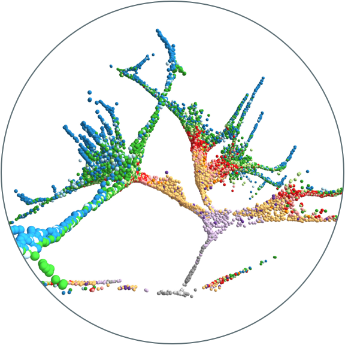
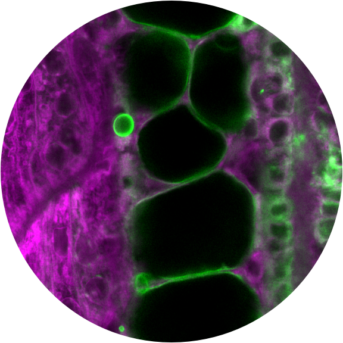
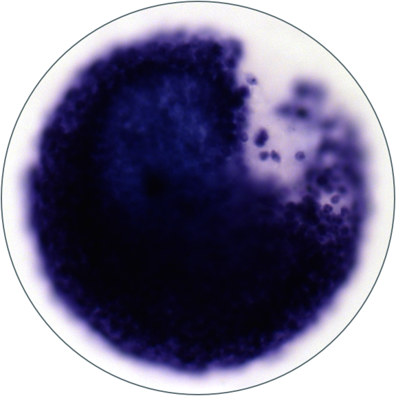

# Cell Specification

<figure class="figtwocolright"></figure>

During development, external and intrinsic cues drive cascades of gene expression within cells that direct them to become particular cell types. What genes drive these decisions, and how stereotyped are these transcriptional cascades across cells that adopt a similar fate? Do differences in the specification process result in lasting differences in cells within a cell type? We recently developed an approach to reconstruct developmental gene expression trajectories from thousands of single-cell transcriptomes. This lets us track which genes are expressed as cells are specified into different cell types and to investigate how stereotyped those expression patterns are. We aim to further develop our approach and apply it to study cell fate decisions during other stages of development, how developmental history affects cell fate decisions, and how those decisions are disturbed in developmental mutants.

# Cell Differentiation

<figure class="figtwocolleft"></figure> 

Differentiated cells have beautifully diverse shapes, structures, and functions. How does the embryo regulate the tiny molecular machines that transform cells? While described for some cell types, we do not understand the cell biological programs deployed in most cell types, how cell remodeling during development is encoded in the genome, nor how much of each remodeling program is reused in different developmental contexts. To address these questions, we are identifying groups of co-expressed and co-regulated genes from our scRNA-seq data, associating them with the cell biology that occurs in their respective cell types, comparing their use across tissues, and using reverse genetic and imaging approaches to determine their function.

# DNA damage in early development

<figure class="figtwocolright"></figure> 

How do cell in early embryos cope with DNA damage? They have unusually rapid cell cycles, lack a DNA damage check-point, have reduced DNA repair capacity, and often cannot trigger apoptosis. We've found that cells in early zebrafish embryos transcribe an unusual group of genes in response to DNA damage and seem to exhibit a bias in the downstream cell types they can differentiate into. How does this cell type bias emerge? Why is there a specific response to DNA damage before gastrulation, and why does it include developmental regulators? To address these questions, we are combining single-cell transcriptomics, transgenic reporters, and CRISPR/Cas9 mutagenesis to track the behavior and fate of damaged cells and to determine the function of their pre-gastrulation transcriptional response to DNA damage.

