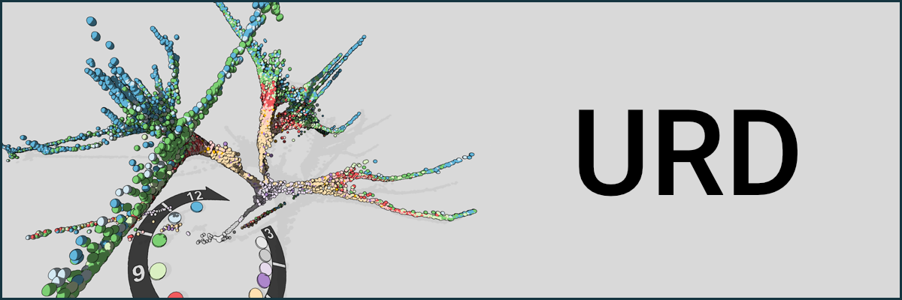

# Our software is maintained in our [Github Repository](http://www.github.com/farrellja/).

-----------------

[URD](https://github.com/farrellja/URD) is an R package for reconstructing transcriptional trajectories underlying specification or differentiation processes in the form of a branching tree, using single cell RNA-sequencing data. URD uses a diffusion map projection of the data and works by simulating biased random walks through that projection.

Visit URD's [Github repository](https://github.com/farrellja/URD) to get started by [installing it](https://github.com/farrellja/URD/blob/master/INSTALL.md) and trying out the [quick-start tutorial.](https://github.com/farrellja/URD/blob/master/Analyses/QuickStart/URD-QuickStart-AxialMesoderm.md)

URD is described and applied to early zebrafish embryogenesis in:

**[Single-cell reconstruction of developmental trajectories during zebrafish embryogenesis.](https://www.ncbi.nlm.nih.gov/pubmed/29700225/)** 
<u>Farrell JA & Wang Y (equal contribution)</u>, Riesenfeld SJ, Shekhar K, Regev A & Schier AF (equal contribution). 
*Science* 26 Apr 2018. doi: 10.1126/science.aar3131