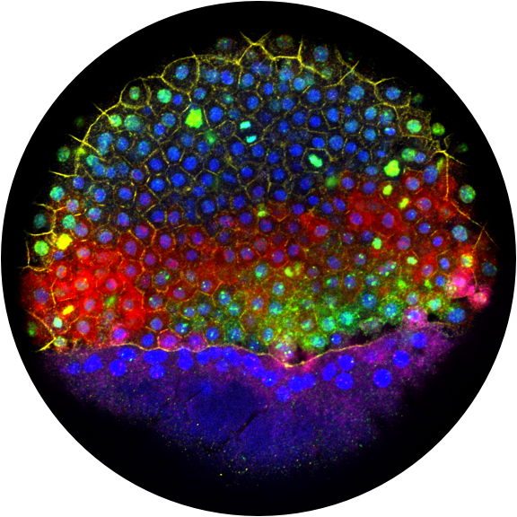

# The lab will open in January 2020, and we are actively recruiting lab members. Please [apply](/apply)!

------------------

# Our research

<figure class="figtwocolleft">
  
     
  <h2><a href="/research" style="text-align: center;">Learn more about our research.</a></h2>
</figure> 

Every embryo starts as a single, fertilized cell. It must then build itself into a complex collection of cells specialized for particular functions: light perception, oxygen transport, structural integrity, propagation of the next generation, and many others. How do embryos do this? What journey does each cell take as it transforms from a cell with many potentials into a differentiated cell with a specific identity and function? How are these transformations encoded in and coordinated by the genome?

  

We combine single-cell genomics, imaging, genetic, and classical embryological approaches to investigate how cell types are specified and then how cells differentiate during vertebrate embryogenesis. We focus on zebrafish embryos as a model system to study these questions, because among vertebrates, they are easy to culture, image, and manipulate both embryologically and genetically.

------------------

Follow Jeff on: <a href="https://twitter.com/{{ site.twitter_username }}">Twitter</a><a href="https://github.com/{{ site.github_username }}">Github</a>
